I study offensive security — fuzzing, web exploitation, and LLM/RAG app security —  
and try to leave public evidence when I find something real.

---

## About Me

I'm a third-year Software Engineering student at **Soongsil University**, focused on
vulnerability research and hands-on offensive security.

At **ASC**, the university hacking academic club, I practice system security and CTF.
I completed **White Hat School 3rd cohort** as a **Top 20** graduate, and I keep working
on finding real bugs — not only solving lab challenges.

My goal is simple: find real issues, understand why they happen, and write them down
so other people can learn from the same path.

## Focus

| Area | What I work on |
|---|---|
| **Vulnerability Research** | Fuzzing (AFL++), triage, root-cause analysis, responsible disclosure |
| **Web Exploitation** | SSRF, request smuggling, JWT pitfalls, auth/access-control bugs |
| **LLM / RAG Security** | Prompt injection, logging pipelines, challenge platforms for learning |
| **Reverse Engineering** | Dynamic analysis with Frida (AOB / signature-based hooks) |

## Featured Work

### ThorVG — `CVE-2026-45729` (CWE-476)

Found a NULL dereference in ThorVG via **AFL++** fuzzing with valid SVG seeds.
Minimized the crashing input to a 6-byte trigger (`<svg><`), reproduced under ASAN,
and reported it through responsible disclosure.

**Focus:** Fuzzing · Crash triage · Root-cause analysis · DoS / availability impact

### Hackahoy — Web · AI security challenge platform (capstone)

Building an education platform where learners practice real web vulns with help from
a RAG-based AI tutor. I own the main **Next.js** frontend, an **OpenResty (Nginx + Lua)**
reverse-proxy logging pipeline, and challenge design for web wargames.

**Stack:** Next.js · OpenResty/Lua · RAG · Web challenge design

### [llm_intheloop](https://github.com/yeahhbean/llm_intheloop)

ASC project (25-1) exploring LLM-in-the-loop ideas for security learning / tooling.

### [Laravel-CVE-2018-15133](https://github.com/yeahhbean/Laravel-CVE-2018-15133)

Hands-on reproduction / study notes for a known Laravel RCE class CVE.

### [Rex](https://github.com/yeahhbean/Rex)

Team entry for a 2025 software contest.

## Tech Stack

## Currently

- Building and hardening **Hackahoy** (frontend + OpenResty logging + RAG tutor flow)
- Growing a portfolio of **real findings** (extra CVEs / bounty reports + writeups)
- Practicing web/pwnable on DreamHack and keeping CTF skills sharp
- Studying LLM security tooling (garak / PyRIT / promptfoo) as an edge on top of offensive work

## Selected recognition

- **White Hat School 3rd cohort — Top 20**
- **ThorVG `CVE-2026-45729`** — reporter credit via responsible disclosure
- Capstone: **Hackahoy** web · AI security education platform
- Creative Engineering Design contest — grand prize (뚜도둑 / CV + Arduino team project)

---

## GitHub Analytics

  

  

<!-- profile -->
